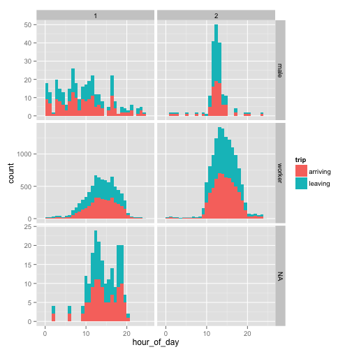

Look at some plots:


```r
library(ggplot2)
load("wasp_caste.rda")
ggplot(wasp_caste, aes(hour_of_day)) + geom_histogram(aes(fill = trip)) + facet_grid(caste ~ 
    group, scales = "free_y")
```

 


```r
# ggplot(wasp, aes(time_diff)) + geom_histogram(aes(fill = trips)) +
# facet_grid(caste~group, scales = 'free_y') + scale_x_log10()
```


```r
# ggplot(wasp_summary, aes(ordered_tag, median_trip, colour = trips, pch =
# caste)) + geom_pointrange(aes(ymin = l_quant, ymax = u_quant)) +
# scale_y_log10() + scale_shape_manual(values=c(21, 19)) +
# scale_linetype_manual(values = c(2, 1)) +
# theme(axis.text.x=element_text(angle=90, size = 8)) + xlab('') +
# ylab('Median trip length (hours)') + facet_wrap(~group, nrow = 2, scales =
# 'free_x')
```

